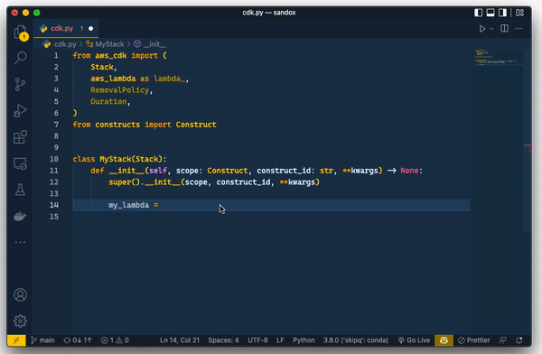

# CDK Snippets for Python

A minimal set of code snippets for AWS CDK v2 to boost your productivity.

## Inspiration
Inspired to not only consume but contribute.
It all started from learning, earning, and working in cool ways, helping others and sharing our ideas for better growth of all, and our laziness of being done anything in simple and easy ways, and as from IT background, simple means minimizing our code, and why not to help others to save their time from writing irritating long scripts.
we try to put ourselves first as much as we can, so we Will be able to support the people around us.

And when it comes to helping and supporting, there comes open source, and when it comes to open source, We especially want to thanks Dr. Ayesha Ashfaq who is doing a great job at Skipq by making young graduates job ready by conducting extensive and fun training and shortening the gap between industry and academia. (great people great work)

## Catalog

Click [here](./CATALOG.md) to know more about available snippets.

## Feature Request

If you have a feature request or an issue, please head over to issues on [GitHub](https://github.com/sameeramin/cdk-snippets-for-python/issues).

## Release Notes

### 1.0.0

Initial release of CDK Snippets for Python.

## Contributing
You're welcome to contribute to this project by adding more snippets or fixing existing ones.

## Authors
[Muhammad Sameer](https://github.com/sameeramin), [Ayesha Goheer](https://github.com/ayeshaq2022skipq)